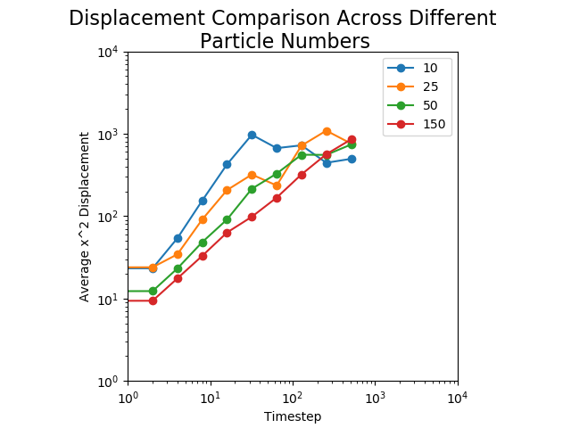

# Modelling Brownian Motion
by Annabelle Platt 

## Overview
The purpose of this project is to replicate Brownian motion with colliding particles, as explained in the paper *Introduction to the Colloidal Glass Transition* by Eric Weeks. 

## Running the Code 
There are several pre-built ways of interacting with this code. I have provided multiple scripts that perform different functions. These are:

`size_comparison.py`: Runs four concurrent models with differing numbers of particles in the same size environment to visually illustrate how different particle densities affects the overall particle motion.

`displacement_single.py`: Runs a single model side-by-side with a graph of average particle displacement, to show how displacement increases over time. This can be run multiple times with varying numbers of particles to get a sense of how particle density affects displacement.

`displacement_comparison.py`: Runs four different models of the same size with differing numbers of particles over many timesteps. Instead of showing particle movement, however, this script shows how the displacement changes over time, so we can see how the displacement diverges at different densities.

If you wish to simply run an animation, you can create a new script. There are only two line of code necessary:

First, create an instance of the model class. The parameters, which are timestep, box size, and number of particles respectively, can be changed, but these values work nicely as a starting point:

`model = Model(.01, 35, 100)`

Next, just call the model method to run the animation:

`model.run_loop()`

## Modelling Decisions

### Assumptions
I am assuming no friction and no viscosity. Particle masses are equal to their radius, so larger particles have more mass. 

### Teleportation
To avoid problems where particles spawn inside each other and get stuck bouncing back and forth because their momentums are not enough to allow them to escape each other, I implemented a simple teleportation mechanic. This works by tracking all the particles a given particles collided with in the previous time step. If two particles collided with each other in the last timestep, they will not transfer momentum again. They will instead be able to move through each other, which allows them to escape from each other. While this is not entirely physically accurate, I wanted to avoid placing particles in an artificial grid, which is both also inaccurate and could have longer-term effects on the model at high particle densities. 

## Benchmarking
To show that this model reproduces Brownian motion, I created log-log plots of the average displacement over time. A straight line with a slope of 1 means I have successfully replicated a liquid. A non-linear line that bends off with smaller slope is a glass, and a straight line with a very low slope would be a crystal. 

As shown in the image below, I have simulated a liquid. The average displacement decreases as particles increase, which makes sense because the more particles present, the less particles will be able to travel since they will run into other particles. 

Notably, the strange beavior around 10^3 is likely impacted by the size of the box, which is 4900 square units. 

By upping the particle count considerably I could theoretically simulate a glass, but my collision handling is not optimized as noted below, so this would make the simulation run very slowly. 

## Limitations

### Collision Handling
The handling of collisions in this model is relatively simplistic and could be further optimized to improve runtime. Currently, collisions are checked for between every particle, even particles that are nowhere near each other in the environment. This runs smoothly with up to about 100 - 150 particles, but becomes progressively more laggy beyond that point. I could have chosen to optimize this further, but my goals for this project were based on the physics of the simulation so I decided to focus on that rather than the optimization element.

Collisions are also handled in order of which particle comes first in the particle list, so they are not resolved randomly. This could have a small but measurable impact over time.

### Wall Collisions
Particles can sometimes spawn in walls and become trapped in a momentum loop. With enough particles this becomes a negligent number of particles, and other particles can still bounce off these particles so I chose to use the [ostrich algorithm](https://en.wikipedia.org/wiki/Ostrich_algorithm) on this problem. Although the problem isn't super rare, it would take a decent amount of time and energy to fix, and it isn't really impacting the outcome of the simulation.
